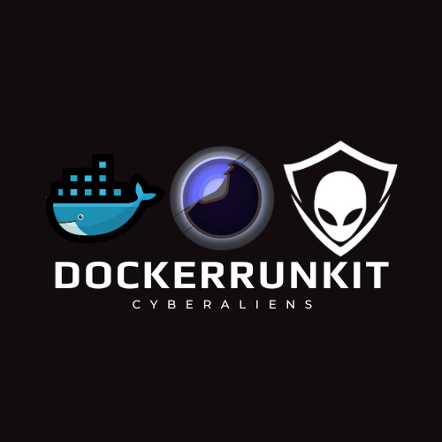

### GitHub Documentation for API DockerRunKit

---

 

 


# DockerRunKit

DockerRunKit is an API solution developed by CyberAliens to manage VPS servers efficiently, enabling each team to run PWN and WEB challenges independently without port conflicts. This project is built using the FastAPI framework.

## Table of Contents

- [Introduction](#introduction)
- [Installation](#installation)
- [Usage](#usage)
- [API Endpoints](#api-endpoints)
- [Directory Structure](#directory-structure)


## Introduction

We are excited to introduce our new API, DockerRunKit. Developed in response to challenges faced during our CyberAliens competitions, DockerRunKit aims to provide a seamless solution for managing VPS resources and avoiding port conflicts during PWN and WEB challenges.

First, we hope to make changes and provide solutions from CyberAliens. The main reason for this API is that CyberAliens hosts three competitions, and the PWN and WEB challenges often experience downtime because all users use the same port for the same challenge. After our competition, Qays Sarayra and Abdulrahman Almeslamani, the CTO and CIO of CyberAliens and leaders of the ECCO team, searched for a solution.

### Key Features:
- Manages VPS servers and allocates more resources dynamically.
- Allows each team to run challenges any time with unique ports assigned for each session.
- Built using the FastAPI framework.
- Checks for Docker images in DockerHub if they are not present in the environment.

## Installation

To install DockerRunKit, follow these steps:

1. Clone the repository:
    ```sh
    git clone https://github.com/EvilGroundZero/DockerRunKit.git
    cd DockerRunKit
    ```

2. Install dependencies:
    ```sh
    pip install -r requirements.txt
    ```

3. Set up your environment variables:
    ```sh
    export STATIC_API_KEY="YourSecretKey"
    ```

4. Run the API:
    ```sh
    nohup python3 app.py &
    ```

## Usage

To use the API, create a secret key and hash it with SHA-384. Send the Docker command to run with the following format:

```sh
http://ip:8000/runcmd/?api_key=yourhashedkey&command=DockerCommandRun
```

If the Docker image does not exist in the environment, the API will check DockerHub for the image.

### Example:
```sh
curl "http://ip:8000/runcmd/?api_key=yourhashedkey&command=docker run -d -p 61001:10000 tmmaz/ofb:tagname"
```

## API Endpoints

### Run Command

**GET** `/runcmd/`

**Parameters:**
- `api_key` (str): Your hashed API key.
- `command` (str): The Docker command to run.

**Response:**
- `message` (str): Status message.
- `unused_port` (int): The port assigned for the Docker command.

## Directory Structure

```plaintext
├── app
│   ├── app.py
│   ├── portidentification.sh
│   ├── run_and_stop.sh
│   ├── requirements.txt
    
```

 

---

 
